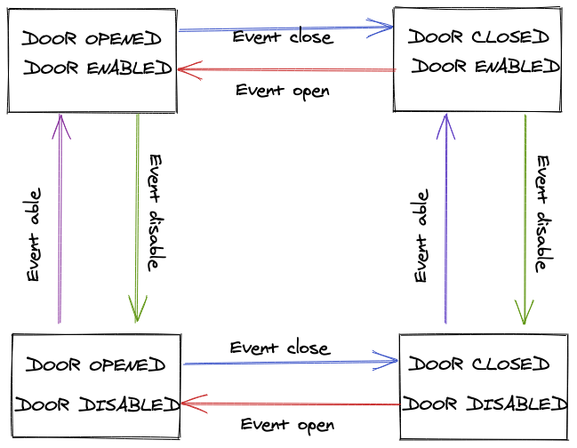

# State-machines

- What is a state?
- What is a state machine?
- Benefits
- Drackbacks
- Vocabulary
- Examples (bowling and others)

## What is a state?

It's a description of the status of a system that is waiting to execute a transition.

## What is a state machine?

It’s an abstract concept whereby the machine can have different states, but at a given time fulfills only one of them.

## Why we should design with state machine modelling?

User interface software is event driven. Each user interface object can respond to external events such as those supplied by a user, the operating system, or the application itself.
For instance, when a user clicks a button on a screen, an event is supplied to the applica­tion and the application can be programmed to respond to this event by executing a sequence of code. When the sequence of code completes execution, the application stops and waits for the next event to be supplied.
The sequence of external events supplied to the application determines **the flow of control**.

It is common for more than half the budget of a client-server project to be spent on the development and maintenance of the user interface. The reason for this is the complexity of the code that is written in the event handlers of user interface objects.

Despite the amount of code that is written. The bottom-up approach code can be difficult to understand and review thoroughly:

• the code can be difficult to test in a systematic and thorough way;
• the code can contain bugs even after extensive testing and bug fixing;
• the code can be difficult to enhance without introducing unwanted side-effects;
• the quality of the code tends to deteriorate as enhancements are made to it.
• There is no abstract view of the software (we have to go line-by-line to understand the overall picture)
• The contexts are not explicit (Many of the event handlers contain conditional statements to determine the context in which an event occurs)

## Benefits of state machine

- Centralize all of the possible scenarios in one area
- Make impossible states actually impossible
- Defined execution path

## Drawbacks of state machine

If number of states grows too large, so does the complexity of the verification procedure, possibly making the technique unusable.
The number of states of a model can be enormous. For example, consider a system composed by n processes, each having m states. Then, the asynchronous composition of these processes may have m^n states.

We can conclude:

- Finite state machines cannot model user interfaces without being extended
- The number of states increased rapidly with only a modest rise in the complexity of the system being modelled
- There were many duplicated states and events
- The state transition diagram was large and difficult to read
- State transition diagrams are not scalable

## Examples

TODO: https://kentcdodds.com/blog/implementing-a-simple-state-machine-library-in-javascript

## Solution with statecharts

TODO: https://statecharts.github.io/

Ref:

https://www.smashingmagazine.com/2018/01/rise-state-machines/

References:

- http://citeseerx.ist.psu.edu/viewdoc/download?doi=10.1.1.261.3888&rep=rep1&type=pdf
